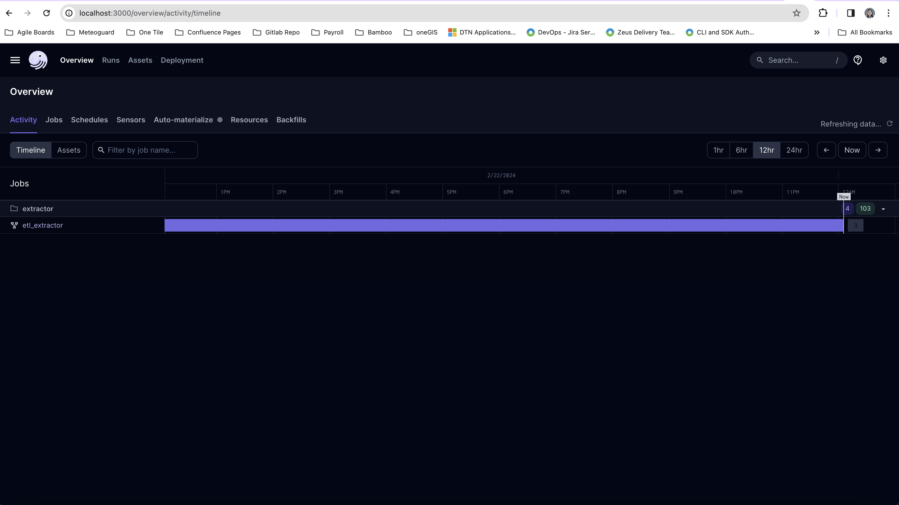
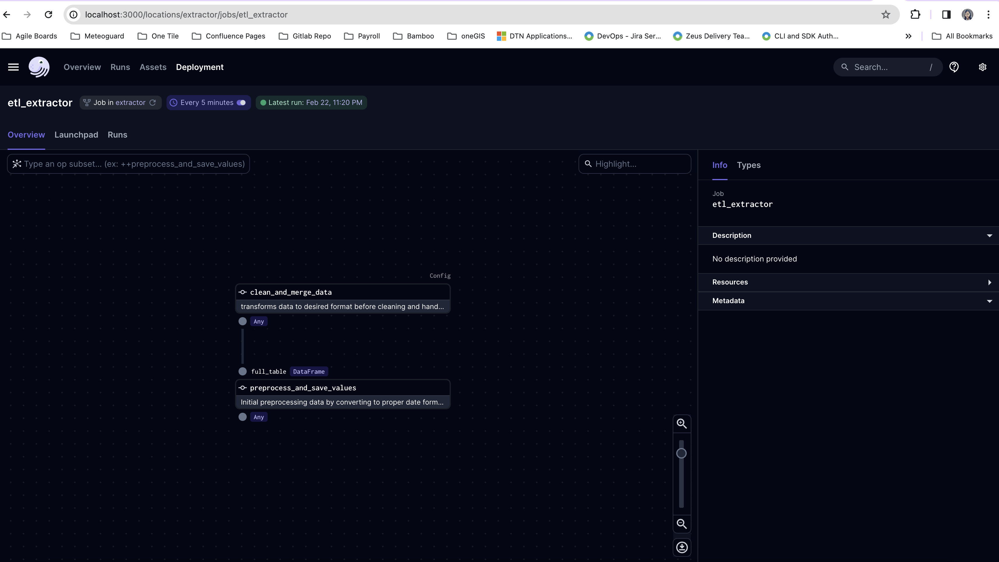
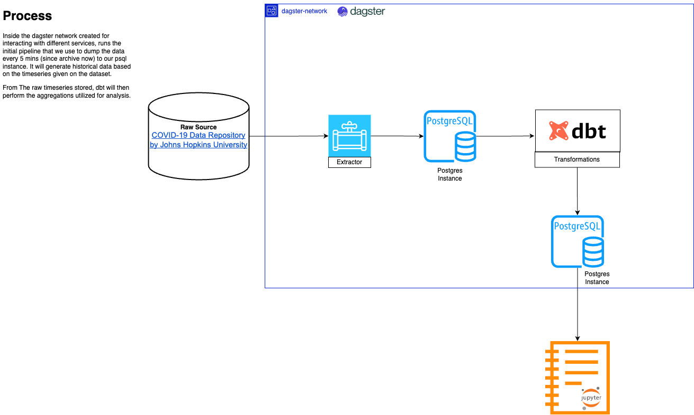

# covid-19-pipeline
Dagster solution on the covid 19 dataset by john hopkins university

## Setup
## Dagster Setup
Dagster currently has an extractor from the source that extracts the file from the given raw github files in the dataset and
does an initial transformation so that dbt can process it in an aggregated manner. Here is how you can run the setup:

`sh. run.sh`

**NOTE**: The command below is run using MacOS 13, there may be similarities for windows but I have not tried it yet on that OS.

After this, you should get the following:

## DBT SETUP
In order to setup dbt, you can simply run:

`dbt run --debug`

With that, 3 tables will be generated in our psql instance.

For future work, this can be containerized given that it currently running locally, there is a bit more work to do for it's setup to join the orchestrator above.

## Design Solution
covid-19-pipeline is an orchestrated pipeline that currently acquires data from 1 source, which is the COVID-19 Data Repository by Johns Hopkins University. At its core, it is an etl pipeline composed of different task from other container isolated tasks. The following diagram shows the overall system architecture and how most representative components interact with each other. 

### Tech Stack
* DBT - for aggregating the ingested timeseries from extractor pipeline
* Dagster - for a high level management of the pipelines
* PSQL
* Python - for extracting the csv to be utilized by the pipeline.
* Docker - To isolate each task and build dependency on the database to introduce checkpoints in data processing.

## Questions:
What are the top 5 most common values in a particular column, and what is their frequency?

**Answer**: One of the most common values we see in a column is the count of how many deaths, confirmed cases and recovered overtime as the purpose of the dataset is more of a reporting and historical tracking set.

How does a particular metric change over time within the dataset?
- We can see in the historical data shown in analysis.ipynb that we can derive some key questions that opens up particular metrics based on the data, they are:
1. Is the infection rate under control?
2. Is the healthcare capacity sufficient?
3. Is the contract tracing sufficient and effective?
4. Is the level of compliance suffiecient to control the infection rate?
5. How prepared and protected out essential workers are?

Given this questions we can derive metrics like:
* Daily Case Incidence
* Number of confirmed and probable deaths
* Percent test Retruning Positive
* Number of tests conducted per day
* Percentage of residents complying with the regulatory guidance
* Geographical containments to reduce increase of cases

Given the metrics, we can see that overtime, some geographical locations increases with the cases and some become lower. It also shows that overtime given the timelapse analysis done, the number of cases shows a decrease of deaths, active cases due to the containment and respondence over the years.

Is there a correlation between two specific columns? Explain your findings.

**Answer**: In the raw source, we can see that geographically, what is correlated is the longitude and latitude of the country in a region if any. We can also observe that the movement of the data lies on 3 values (Confirmed, Deaths, Recovered) where we can conclude the active cases, and how fatal the desease is during a specific timeframe.  This also shows us the efforts of tracking and utilizing the data to further prevent the spread in terms of geographical localtion.

